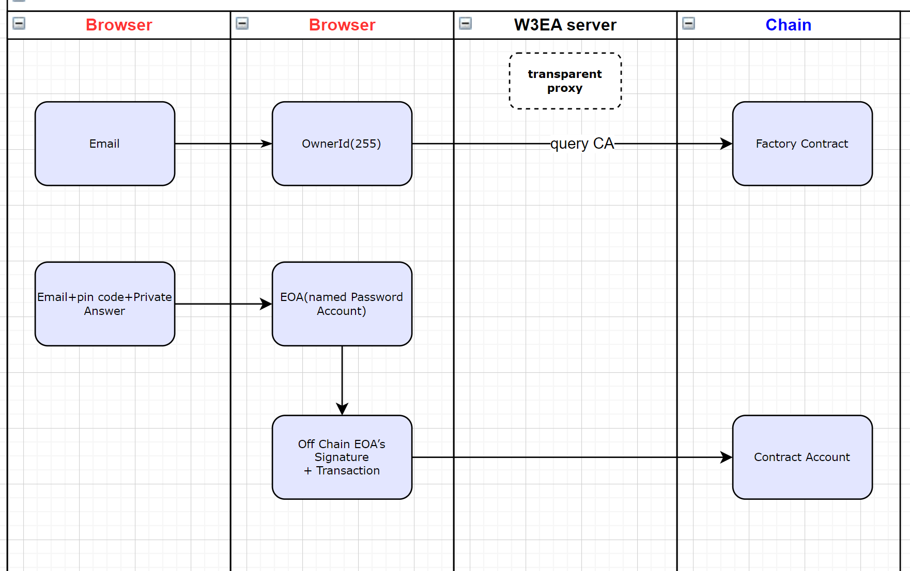
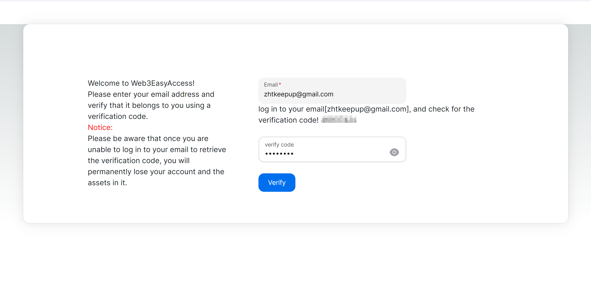
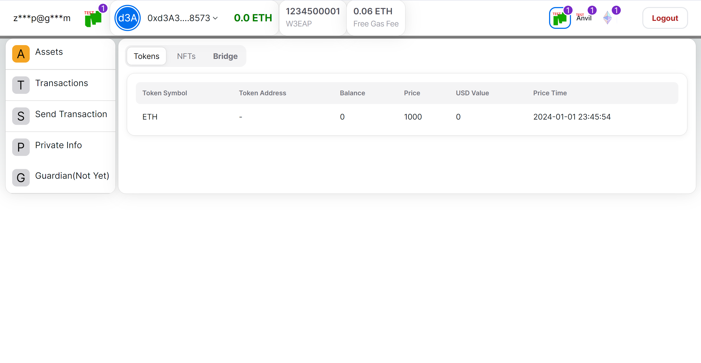
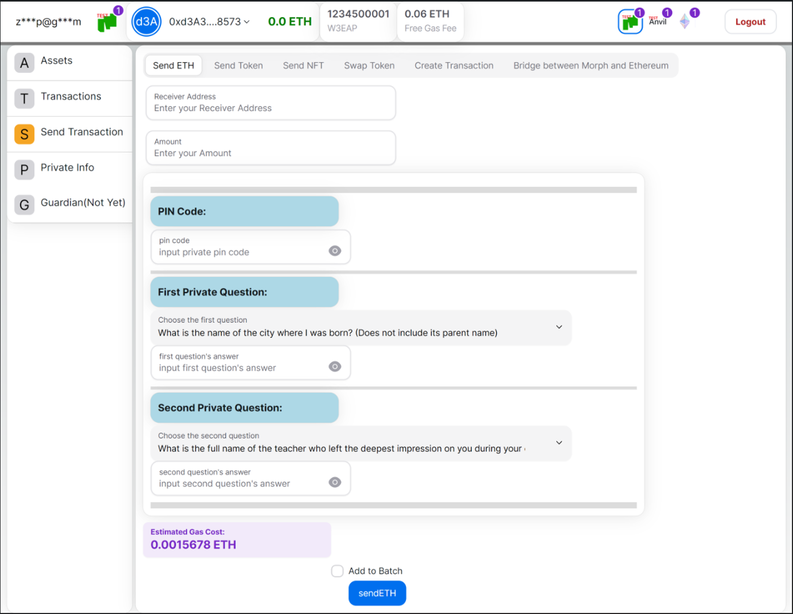

# Web3EasyAccess

欢迎使用: [web3easyaccess.link](https://www.web3easyaccess.link/)

## Web3EasyAccess 是什么

Web3EasyAccess, 提供一种轻松访问 web3 世界的方法，人们可以像登录普通 Web2 网站一样登录本网站，进而管理去中心化资产，探索去中心化世界。\
通过本系统提供的服务，用户无需管理助记词或私钥，而是通过用户自己的密码信息对账户进行控制，同时保留“去中心化”的关键特性。同时，用户也可以现有的密码信息进行修改。

## 系统实现原理

### 前置知识: 什么是 EOA 与 CA

-   Externally Owned Accounts，简称 EOA。是区块链（例如以太坊）上的一种账户类型。每个 EOA 都有对应的私钥，以太坊上的交易都是由 EOA 发起的，并由发起交易的 EOA 支付网络费用（gas 费）。普通用户若需要使用 EOA，则需要使用去中心化钱包管理助记词，并由助记词派生出私钥与 EOA。
-   在以太坊上还有另一种账户类型：合约账户（Contract Account），CA 没有私钥。
-   合约账户不能主动发起交易，但合约账户可以编写智能合约代码，实现复杂的业务逻辑控制。
-   合约账户与 EOA 账户都可以管理资产。

### 实现原理

#### 创建账户

如上图，在浏览器端，有两个环节（或两个部分）：

1. 一是根据用户的 email 派生出用户的 ownerId，当前最多支持 255 个，每个 ownerId 都对应一个独立的资金账户(智能合约账户)；
2. 二是根据用户的 email 及密码信息派生出用于控制用户账户的 EOA 地址(普通钱包地址)，我们称之为“密码地址(password address)”，该地址不暴露给用户，用户也无需关心。同一个 email 下的多个资金账户共用一个 “密码地址”。
3. 应用服务器后端起到透明代理的作用，基于用户的信息，调用工厂合约创建合约账户。

#### 发起交易

如上图，用户发起交易时，需要输入密码信息，系统在浏览器端生成“密码地址”，并为“密码地址”生成一次性电子签名。然后我们的系统将用户的电子签名发送给用户的智能合约资金账户，在智能合约内对用户的签名进行验证，验证通过才会执行后续的交易。

应用服务器后端（W3EA server）的功能是，接收用户的请求并使用专用的 EOA 向区块链发起请求，包括：创建账户与发起交易。创建账户时将请求发送给一个“工厂合约”，工厂合约为用户新建一个独立的智能合约账户。整个流程里，我们的后端系统永远不会获知用户的密码信息，更无法保存用户的密码信息。

### 密码信息的去中心化解释

1. 本系统仍然保有区块链产品的关键特点：“去中心化”，即本系统不存储用户的私密信息，副作用是用户一旦遗忘个人密码信息，将丢失对账户的控制权，且无法恢复。（在未来，当系统实现账户守护功能之后，则用户可以设置亲友地址，通过亲友账户找回账户）
2. 用户的邮箱无法用于找回密码。

### 用户的 GAS 费如何支付

-   发起交易时系统自动计算当前交易所需费用，并将费用作为参数传入用户合约，交易的同时直接将费用从用户的账户中扣除。
-   若发起交易后实际执行失败，则会造成系统资产损失（用户无损失）

### 交互奖励设计

-   用户在系统中交易时将获得 token(W3EAP)奖励，按交易时支付的 gas 使用量计算奖励基数，并由基数乘以一个倍数获得本次奖励的数量。奖励的乘数随着时间推移而递减（以 2024 年 7 月 1 日开始，奖励乘数初始值是 12，大约每过一个月而减少 1，大约一年后恒定为 1）.
-   代币 W3EAP 拥有的功能目前暂未定义，将在未来赋能。

## 操作方法

（备注：随着系统的升级，以下截图和实际可能有差异）

### 登录

访问 https://www.web3easyaccess.link/login ，然后输入你的 email 地址获取验证码，提供验证码后登录系统，参考下图：

注意：email 及其验证码，仅用于识别一个用户，无法用于密码找回，如果你遗忘密码，将永久失去对账户的控制权。

### 查看资产

点击“Assets”菜单，展示用户资产信息，如下图：

### 查看用户基本信息

在导航栏显示用户的基本信息，如下图，提供对导航栏里的各个数据项的说明：

### 查询账户交易明细

点击“Transactions”菜单，可查看账户的资产交易记录与操作日志。如下图：

### 发送交易

点击“Send Transaction”菜单，可发起交易，向别人转账 ETH 或者 token。如下图：

### 修改密码

点击“Private Info”菜单，可在该页面执行“修改密码”的操作，如下图：

## 未来功能计划(roadmap)

1. 发起交易页面增加功能：转让 token、转让 NFT、自定义交易参数、对接 swap、内置 L2 与 L1 桥接
2. 增加账户守护功能
3. 对接更多链（EMV 及其他）
4. 资产增加按 U 计价
5. 增加其他资产用于支付 gas
6. 增加合约账户升级.
7.

