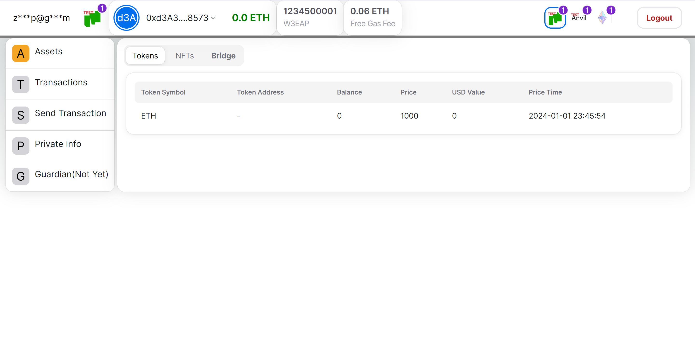

## W3EA

[web3easyaccess.link](https://www.web3easyaccess.link/)

## 目标(Goal)

当前人们访问区块链世界时通常需要管理助记词或私钥，而助记词或私钥无法记忆，同时针对同一个账户，用户也无法修改密码，一旦助记词或私钥泄露，对应的账户将不再安全。
通过本系统提供的服务，用户无需管理助记词或私钥，而是通过用户提供的私密信息对账户进行控制，同时保留“去中心化”的关键特性。在输入正确的私密信息的情况下，用户也可以对其现有的私密信息进行修改，达到传统意义上的“修改密码”功能

## 架构(Architecture)

如上图，在浏览器端，有两个环节（或两个部分）：

1. 一是根据用户的 email 派生出用户的 ownerId，当前最多支持 255 个；
2. 二是根据用户的 email 及私密信息派生出用于控制用户账户的 EOA 地址。同一个 email 下的多个合约账户公用一个 passwordAddr。

在应用服务器后端（W3EA server），接收用户的请求并使用专用入口 EOA 向区块链发起请求，包括：创建账户与发起交易。
创建账户时，由链上的工厂合约为每个账户创建独立的合约。执行交易时，用户在浏览器端使用 passwordAddr 生成离线签名，然后应用的后端服务器使用用户的离线签名代替用户发起交易。在每个独立的账户合约内对离线签名进行认证并执行后续交易。

## 私密信息的去中心化(Decentralization of users' private information)

1. 本系统仍然保有区块链产品的关键特点“去中心化”，即本系统不存储用户的私密信息，副作用是用户一旦遗忘个人私密信息，将丢失对账户的控制权，且无法恢复。
2. 用户的邮箱无法用于找回密码。

## 用户的 GAS 费如何支付

发起交易时系统自动计算当前交易所需费用，并将费用作为参数传入用户合约，交易的同时直接将费用从用户的账户中扣除。

## 交互奖励设计

## 未来功能计划

1. 发起交易页面增加功能：转让 token、转让 NFT、自定义交易参数、对接 swap、内置 L2 与 L1 桥接
2. 增加账户守护功能
3. 对接更多链（EMV 及其他）
4. 资产增加按 U 计价
5. 增加其他资产用于支付 gas

## 主要功能截图

